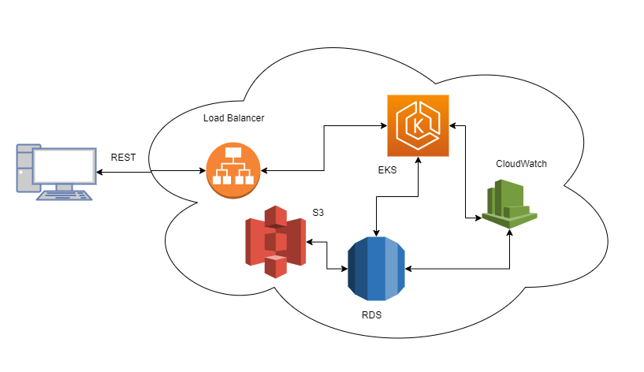

## Hello world app

This is a simple hello world app.

## How to run
Note: You require postgres on docker to run this app.

```bash
docker-compose up db -d
mvn spring-boot:run
```


## System diagram

System diagram of the solution once deployed to AWS

